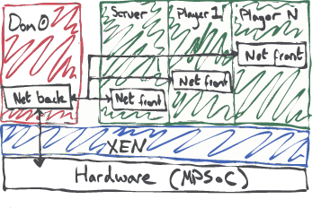

# 0verkill XEN Demo

To make Xen showing off Xen a bit more fun, we've come up with a "LAN Party on Chip" demonstration.
This is inspired by the "Running Doom on the Zynq MPSoC" article [here](https://issuu.com/xcelljournal/docs/xcell_software3/6).

We demonstrate how to use Xen to isolate a few different linux instances, share resources like the network interface, and go through the steps needed to create this using the PetaLinux tools.

The finished system looks a little like this:




# How to build

The entire build process is scripted, so if you're not interested in how it works (or just want to play games ASAP), you can just run the following commands:

```
source <path_to_your_petalinux_2016.2_install>/settings.sh
./init_client.sh
./init_server.sh
./init_demo0.sh
```

This builds the game server domain, the game client domain(s), and then the host domain which controls the network interface/boots up the game server & client domains.

Feel free to dive into each of these scripts - they are exactly what you'd need to type to do the project manually!
Here's a quick summary of what each script does...

init_server.sh: sets up a DomU for game server:
 + Create petalinux project
 + Enable dropbear ssh (same as going through `petalinux-config -c rootfs`)
 + Add 0verkill_server app from dist folder
   - This app grabs the 0verkill game from this [git repo](https://github.com/hackndev/0verkill)
   - Cross compiles it using aarch64-linux-gnu- supplied with PetaLinux
   - Has a Makefile to copy the generated binaries to the rootfs (called from `petalinux-build`)
 + Build image

init_client.sh: sets up a DomU for game client
 + Create petalinux project
 + Enable dropbear ssh
 + Add 0verkill_client app from dist folder
   - This is just like the 0verkill_server app, but will copy the client binaries instead of the server binaries
 + Build image

init_dom0.sh: sets up Dom0 with networking for previous DomUs
 + Create petalinux project
 + Enables...
   - Rootfs: bridge utils, ethtool
   - Kernel: XEN network backend
 + Add startup scripts from dist folder
   - These set up the network bridge needed to share the real network interface between each of our VMs
   - Tweaks the network setup to avoid problems with Xen ignoring checksums!
   - Boots the server and multiple client VMs
 + Tweaks the device tree to avoid problems with large kernels
 + Copies over the previously generated linux images for the game server and client
 + Build image


# Run the demo

First, we need to boot the system. We want to:
 + Tell u-boot that we want to load XEN first (not Linux image!)
 + We put Dom0's kernel at 0x80000 so XEN can load it.
 + Go!

## From SD card
Copy over BOOT.bin, Image, xen.dtb, and xen.ub from `dom0/images/linux` to an SD card.
At the u-boot prompt, enter the following:

```
fatload mmc 0 7000000 xen.dtb;
fatload mmc 0 9000000 xen.ub;
fatload mmc 0 80000 Image;
bootm 9000000 - 7000000;
```

## From JTAG + TFTP
Alternatively, we can skip the SD card and boot over jtag with a TFTP server.
First, load u-boot onto the board with

```petalinux-boot --jtag --u-boot```

Similarly to before, we can now load the Linux image and boot Xen...

```
setenv serverip 10.42.0.1
tftpb 7000000 xen.dtb;
tftpb 9000000 xen.ub;
tftpb 80000 Image;
bootm 9000000 - 7000000;
```

Now, play the game! The server should have started automatically, but we'll need to run the clients ourselves.
We'll want to log in over the network to each client VM and start the game... but what's the IP address of the VM we want?
That'll be different depending on your network, but we can find out quite easily!

From Dom0 over the serial connection, we can get patched through to any of the VMs by name.
E.g. for client 1...

```xl console domu_client1```

Now any input/output is send to domu_client1. We can run `ifconfig` to get the VM's IP address!
When ready, press `ctrl`+`]` to return to the dom0 console. From your desktop, you can now ssh into the
domu_client1 VM with something like so:

```ssh root@<that_ip_address>```

Root password is root, because I'm a terrible monster. Run the game with:

```
cd /0verkill
./0verkill
```

And yes, that's not a capital "o", but the number zero. The original developers of the game were way cool.

> 0verkill client doesn't run over serial! Must use ssh! This is something to do with the `$TERM` variable...

# Gotchas for your own designs

 + Network checksum offloading!
   + Xen will ignore checksums on packets...
   + This will cause TCP streams to fail at random
   + Workaround: disable checksum offloading in Dom0
     + `ethtool -K eth0 tx off`
 + Default kernel size in device tree
   + xen.dtb defines a default max size for the Linux image we load
   + This is about 50 MB. We're bigger than that, so we needed to modify xen.dtb's dom0 entry
   + Also ensure that the u-boot commands leave enough room between Image and the xen.ub/xen.dts (we don't want one to overwrite the other!)
 + We had trouble getting a PetaLinux dom0 to support virtual framebuffers
   + Hence the weird ascii-art game...
   + Can do this from buildroot + xen source from [XZD](http://dornerworks.com/services/xilinxxen), but this complicates the demo
